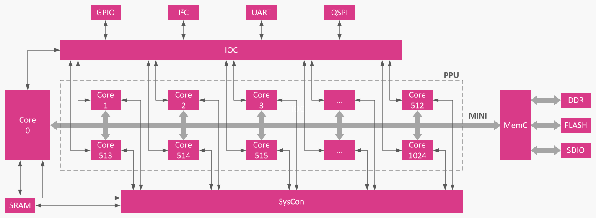
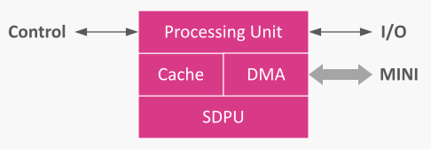
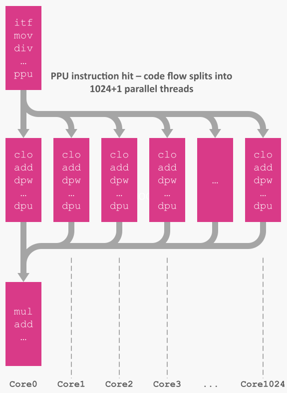

# EPIA - Architecture Overview

## Block diagram

The following image shows the block diagram of EPIA NPU.

Some terminology:

1. MINI - Memory Interface for Neural Inference, main internal memory bus of EPIA NPU
1. IOC - Input/Output Controller, responsible for atomic send and receive of data over various external interfaces (I2C, UART, QSPI, etc)
1. MemC - Flexible Memory Controller, responsible for MINI flow and inter-operation with external memory interfaces (DDR, Flash memory, or SDIO)
1. SysCon - System Controller, a simple 16-bit processor responsible for controlling the execution of each core, arbitrage of requests, etc. SysCon is programmable and its internal microcode is accessible by Core0, making it flexible and adjustable at run-time depending on the type of task the NPU is performing
1. PPU - Parallel Processing Unit - a collective name for the group of homogenous cores used in parallel computations. The full NPU consists of N+1 cores, where Core0 is the main core responsible for sequential parts of the code flow, while cores 1-N are forming the PPU and executing the parallel parts.

### Single core block diagram

Every core in EPIA is identical in its ISA, including Core0. However, Core0 has longer pipeline making it  more efficient in sequential tasks (which is the main bread and butter of Core0) compared to other cores.

Some terminology:

1. Processing unit is responsible for actual code execution, sequencing commands, and controlling other parts of the core
1. DMA - Direct Memory Access engine, responsible for communicating with MINI, fetching data and instructions, or pushing them out
1. Cache is responsible for predictive fetching of data (especially vectored data for SDPU) and instructions for the processing unit. Cache is also used to support fast clobbering (see more in [epia-isa.md](epia-isa.md))
1. SDPU - Scaled Dot-Product Unit, responsible for hardware acceleration of per-block scaled, quantized vectors. Using SDPU with PPU parallelism allows for extremely fast and efficient matrix multiplication

### Execution flow example

In the following diagram we can see the code flow in both sequential and parallel sections. As soon as PPU instruction is executed, the code splits into as many threads as commanded by <size> argument of PPU instruction. If the number of threads is larger than number of available cores, SysCon will schedule execution in such way that as soon as a core becomes free, it will receive the next chunk of computation, turning the PPU into scheduled worker pool. Core0 also participates in this activity, being controlled by SysCon for the duration of the parallel code segment.

When all parallel pieces are processed, Core0 resumes its normal sequential operation, re-starting from the next instruction after the PPU instruction.

Note: in this example, DPU is the last instruction of each parallel code piece. It doesn't have to be - each core will stop execution either at HLT instruction, or by reaching the memory barrier previously set by the PPU instruction.

## Copyright

(C) Dmitry 'sciloaf' Solovyev, 2005

(C) Syntheva AS, 2025
